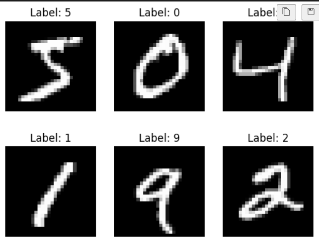
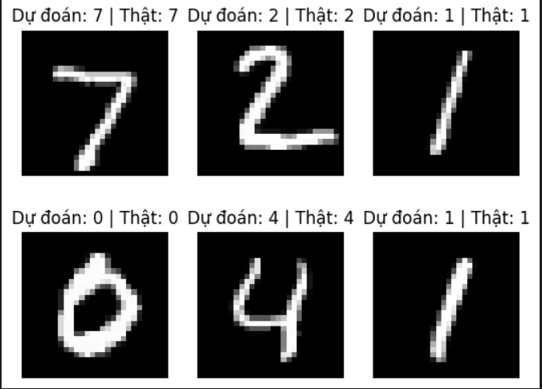

## Giới thiệu
Dự án này xây dựng một mạng Nơ-ron đơn giản từ đầu (bằng NumPy) để nhận diện và phân loại **chữ số viết tay** từ ảnh đầu vào. Ứng dụng sử dụng kỹ thuật học sâu cơ bản (fully connected neural network) để xử lý hình ảnh và đưa ra kết quả dự đoán.

---

## Dữ liệu
Dữ liệu được sử dụng là **bộ dữ liệu MNIST**, bao gồm các hình ảnh chữ số viết tay kích thước **28 x 28 pixel**. Các ảnh đã được chuyển sang hệ màu **Grayscale (đen trắng)** để đơn giản hóa việc xử lý.

<p align="center">
    
</p>

---

##  Cấu trúc mạng

Mạng Nơ-ron trong dự án có tổng cộng **3 lớp**:

- **Input layer**: gồm **784 nodes** (ứng với ảnh 28 x 28 pixel, làm phẳng thành vector).
- **Hidden layer**: gồm **64 node**, sử dụng hàm kích hoạt **Sigmoid**.
- **Output layer**: gồm **10 node**, tương ứng với các chữ số từ **0 đến 9**, sử dụng **hàm Softmax** để đưa ra xác suất cho từng lớp.

```text
Input (784) → Dense (64, ReLU) → Dense (10, Softmax)
```
## kết quả dự đoán

<p align="center">
    
</p>